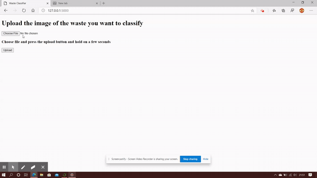

# Waste Classifier
Implementing my knowledge learnt from my "complete-tensorflow-2-and-keras-deep-learning-bootcamp" course.
Made use of Convolutional Neural Network to train the model.
Data taken from "kaggle datasets download -d techsash/waste-classification-data"
Visit the notebook for more details
Training time 4 hours
Accuracy 80% , can be increased by tweaking some parameters in the network
# Watch out the demo below
